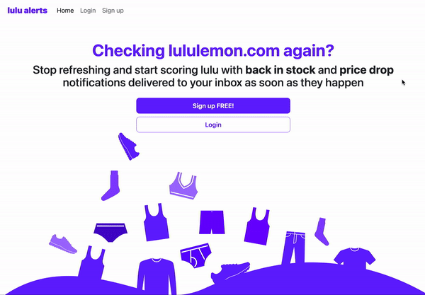
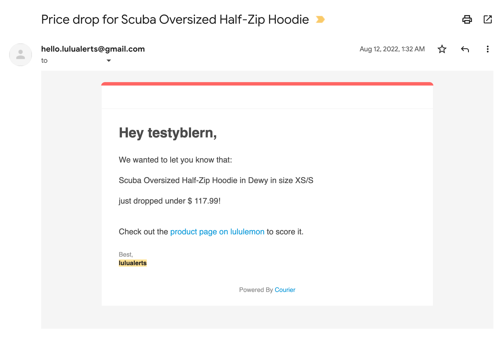

# lulu alerts

## Project overview
lulu alerts makes sure shoppers don't miss out on purchasing their favorite lululemon products as soon as they go on sale or come back in stock with notifications delivered to their inboxes 

### Description
lulu alerts is a web application for creating and managing alerts for lululemon products.  Users create lulu alerts accounts, where they can configure two types of alerts: (1) "back in stock", which notifies them when an out of stock product comes back in stock, as well as (2) "price drop", which tell them when a particular product decreases in price.  On an ongoing basis, the app monitors lululemon.com to see if any existing alerts should be triggered by a particular product price change or product back in stock.  When an alert is triggered, lulu alerts notifies the user via email. lulu alerts scrapes HTML to grab product attributes such as price, color, size, and product name, from lululemon.com during alert configuration and ongoing alert monitoring.

### Technologies
- Python
- Javascript
- HTML/CSS
- Bootstrap
- PostgreSQL
- Django
- Heroku
- [Beautiful Soup](https://pypi.org/project/beautifulsoup4/)
- [APScheduler](https://apscheduler.readthedocs.io/en/3.x/) 
- [Courier](https://www.courier.com/)
- [Visily](https://www.visily.ai/)
- [IONOS](https://www.ionos.com/)
- [UptimeRobot](https://uptimerobot.com/)

<!-- ## Video Demo
 -->

## Use
Visit www.lulualerts.com! Here, you can browse the home page, login, and sign up pages, available to all visitors without accounts.  Sign up for free to create and manage alerts, as well as to recieve notifications.

9/8/2022: lululemon has removed product data from their HTML, which the app relies on for scraping product attributes, so new alerts cannot be created. The www.lulualerts.com site remains active and functional for all other purposes.  There is a plan to migrate from the current approach (scrape HTML using python beautiful soup library) to a browser simulator (i.e. selenium).  No ETA.

## Demo
**Create and manage alerts:**

<!-- 30fps,large -->

**Login & Signup:**
 

**Recieve email notifications:**

## Challenges and Learnings
- **Major failure due to dependency on lululemon.com HTML:** After having lulu alerts up and running for a few months, I noticed alert creation and notification was failing due to no product attributes coming through during scraping.  After assessing my scripts and lululemon.com source code, it appeared the HTML Documents for all lululemon.com product pages no longer contained ANY of the product data (price, product name, color, size ... all gone), and data was instead being rendered with javascript.  Beautiful soup, the scraping library I used, only comes with HTML and XML file parsers, so I cannot access the rendered data with this approach.  This is a MAJOR issue that rendered my app useless.  I plan to explore and implement a different solution, likely using a browser simulator.
- **Limit scope, where possible:** Early on, I had to make a decision about the scope of alerts.  A potential use case to illustrate: "as a user, I want to get the ABC joggers in size 32 when they go on sale in black, navy, or khaki!"  Lululemon, as with most online retailers, would represent the black, navy and khaki size 32 ABC joggers as 3 distinct products.  But for lulu alerts, wouldn't it be nice to let users create a single alert that spanned colors and sizes to increase their likelihood of scoring their lululemon gear and decrease friction caused by configuring multiple alerts?  Turns out, this approach opened many cans of worms. How would a user go about selecting the color/ size combinations they wanted in the UI?  What if some of the color/ size combinations they choose are different prices, or out of stock?   Should I create more tables to map products to alerts?  How many products could be in 1 alert? How do I handle an alert that triggers for all 10 products a user set up in one notification?  I chose to go with the simpler single-product alert for v1, matching lululemon's representation of their products, which I believe still allowed users to achieve what they wanted, and vastly simplified my approach. A possible simple v2 solution here is to allow cloning/ duplicating alerts, and changing color/ size.
- **Edge case research at the outset pays off:** lululemon products varied in how their data was represented. Clearance product webpages differed from non-clearance in how the HTML was structured and in naming conventions. Also, certain products had additional attributes that didn't exist for other products - such as 'length' (relevant only for pants/ shorts), while others were missing attributes - such as 'size' or 'color' (relevant for hats that are only available in one size/ color).   All of these needed to be considered for my scraping approach.
